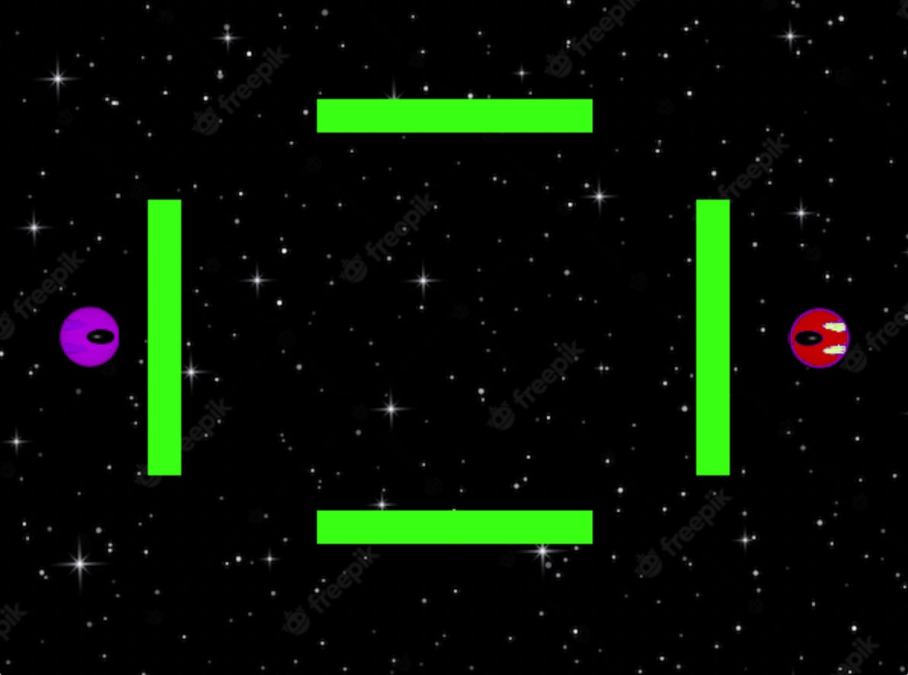
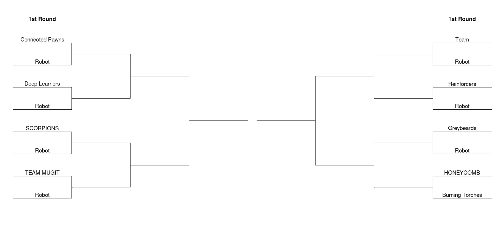

## RL to play Space Shooter :gun::rocket:

You control a spaceship. A rival space-mob has entered your gangs patch.

You challenge their top marksman to a laser wall shootout.

You must terminate your opponent. And you must terminate them using RL.

#### Important!! Read me !!!!

:rotating_light: :rotating_light: :rotating_light: Training an agent to play this game is tricky! Before starting, read the suggested approach at the bottom of this page :point_down: :point_down: :point_down:



## Rules of Space Shooter

Space shooter is a **two-player** top down shooter game. Players take turns synchronously.

The arena is a 2D grid with **4 laser walls**.

The game starts with the **two players** positioned behind random opposite walls in the arena.

Each player can turn, move and shoot. The **goal** :goal_net: is to shoot your opponent :gun: before they shoot you.

At any time, only **two bullets** from a given player can be present in the arena. If the player shoots twice in quick succession, the player must wait until the bullet goes off the **edge of the arena** or strikes a **laser wall** before they can shoot again.

The **laser walls** prevent players and bullets travelling through them.

You ship is not able to leave the arena, but you'd never do that to your space-gang pals anyway!

# Competition Rules :crossed_swords:

## 1. You must build a **Reinforcement Learning agent**

- Rules-based agents are not allowed

## 2. Only write code in `main.py`

- You can only store data to be used in a competition in a neural network (saved in a `.pt` file by `save_network()`)
- In the competition, your agent will call the `choose_move()` function in `main.py` to select a move (`choose_move()` may call other functions in `main.py`)
- Any code not in `main.py` will not be used.

## 3. `check_submission()` must pass!

## Submission deadline: **2:30pm UTC, Sunday**.

- You can update your code after submitting, but **not after the deadline**.

## Competition Format

The competition is a knockout tournament where your AI will play other teams' AIs 1-v-1.

Each 1-v-1 matchup consists of a **best of 5 game** with the **starting positions of the players** chosen randomly (behind a laser wall).

The competition & discussion will be in [Gather Town](https://app.gather.town/app/nJwquzJjD4TLKcTy/Delta%20Academy) at **2:30pm UTC on Sunday** (60 mins after submission deadline)!



## Technical Details :hammer:

### State :space_invader:

The state space is represented as a **1D `torch tensor`** of length **24**.

Each element contains information about the location of objects in the arena.

#### Each object has four elements in the array:

- 1: The x position of the object in the arena
- 2: The y position of the object in the arena
- 3: The sine of the angle of the object in the arena (relative to north)
- 4: The cosine of the angle of the object in the arena (relative to north)

Each element is **normalised** to be between -1 and 1.

#### The following objects are represented in the array (in order):

1. The player you control
2. Your opponent
3. Your first bullet
4. Your second bullet
5. Your opponents first bullet
6. Your opponents second bullet

If you or your opponent have bullets that have not yet been fired, their location is represented by **[0,0,0]**

### Actions :axe:

Each player controls their ships with actions that either move, turn or shoot. Actions are taken by returning an integer from `choose_move`.

| Num | Action                                      |
| --- | ------------------------------------------- |
| 0   | Rotate 15 degrees clockwise                 |
| 1   | Rotate anti-clockwise                       |
| 2   | Move forward in the direction you're facing |
| 3   | Shoot                                       |
| 4   | Strafe left                                 |
| 5   | Strafe right                                |

### Rewards :moneybag:

| Reward | Step                     |
| ------ | ------------------------ |
| `+1`   | You win                  |
| `-1`   | You lose                 |
| `0`    | a draw / all other steps |

### Playing against your bot :video_game:

You can play against your bot by using the `human_player` function to choose_move. You control the spaceship using the .
keyboard with the following controls.

| Key                     | Action       |
| ----------------------- | ------------ |
| &#8593; (`Up` arrow)    | Move forward |
| &#8592; (`Left` arrow)  | Rotate left  |
| &#8594; (`Right` arrow) | Rotate right |
| `A`                     | Strafe left  |
| `D`                     | Strafe right |
| `Space`                 | Shoot        |

## Functions you write :point_left:

<details>
<summary><code style="white-space:nowrap;">  train()</code></summary>
Write this to train your network from experience in the environment.
<br />
<br />
Return the trained network so it can be saved.
</details>
<details>
<summary><code style="white-space:nowrap;">  choose_move()</code></summary>
This acts greedily given the state and network.

In the competition, the choose_move() function is called to make your next move. Takes the state as input and outputs an action.
<br />
<br />

</details>

## Existing Code :pray:

### `ShooterEnv`

The environment class controls the game and runs the opponent. It should be used for training your agent.

See example usage in <code style="white-space:nowrap;">play_shooter()</code>.

#### Arguments to `ShooterEnv`

`opponent_choose_move`
The opponent's <code style="white-space:nowrap;">choose_move</code> function is input at initialisation. The first player is chosen at random when <code style="white-space:nowrap;">Env.reset()</code> is called. Every time you call <code style="white-space:nowrap;">Env.step()</code>, 2 moves are taken - yours and then your opponent's. Your opponent sees the observation vector flipped relative to yours (so their position is first).

`render`
When set to `True`, the game is rendered graphically. This is required for <code style="white-space:nowrap">human_player()</code> to work. Player1 is the pink ship, the opponent is the red ship.

`include_barriers`
When set to `False` this turns the laser walls off. In the tournament the walls will be on, but you can turn them off to make initial training easier.

`half_sized_game`
When set to `True`, the size of the arena is halved. A full sized arena will be used in the tournament, but training is easier in the small arena.

<details>
<summary><code style="white-space:nowrap;">  choose_move()</code></summary>
This acts greedily given the state and value network.
<br />
<br />
In the competition, the <code style="white-space:nowrap;">choose_move()</code> function is called to make your next move. Takes the state as input and outputs an action.
<br />
<br />
</details>

<details>
<summary><code style="white-space:nowrap;">  choose_move_randomly()</code></summary>
Chooses a random action, an excellent first opponent!
<br />
<br />
Takes the state as input and outputs an action.
</details>

<details>
<summary><code style="white-space:nowrap;">  play_shooter()</code></summary>
Plays 1 game of shooter, which is visualised graphically (if <code style="white-space:nowrap;">render=True</code>).

This demonstrates how to interact with the env.

Pass your agent's `choose_move` function as the `your_choose_move` argument.

The remaining arguments to this function are the same as the arguments to <code style="white-space:nowrap;">ShooterEnv</code>.

</details>

<details>
<summary><code style="white-space:nowrap;">  checkpoint_model()</code></summary>
Save a checkpoint of your model so you can train against it in self-play
<br />
<br />
</details>

<details>
<summary><code style="white-space:nowrap;">  ChooseMoveCheckpoint()</code></summary>
Interface to allow the <code style="white-space:nowrap;"> opponent_choose_move</code> function in the environment to be set as a previously-saved checkpoint.
</br>

Use the checkpoint class as follows:

```python
# Train a model
model = ...
# Save the model after the first round of training
checkpoint_model(model, "checkpoint1.pt")

# Create a new env, where the opponent is the checkpointed model
env = PokerEnv(ChooseMoveCheckpoint("checkpoint1.pt", choose_move))
```

</details>

## Suggested Approach :+1:

Start with the laser walls off and with the half sized env, so that your bot learns to orient and shoot at the opponent.

Once your bot learns to beat random in this env. Save your bot and reintroduce either the laser walls or the full sized arena. Then continue training the same bot against random. Finally train against random in the full sized arena with walls, to match the tournament.

Train against a random opponent to start with. As you get better you can train against checkpointed versions of your own bot.

While training don't forget the general adivce for training RL agents:

1. Discuss your neural network architecture - how many inputs, outputs, hidden layers & which activation functions should you use
2. **Write `train()`** (you can borrow code from past exercises).
3. Insert debugging messages & use `tensorboard` for logging - you want to make sure that:

   - Performance on shooter is improving :arrow_up:
   - Loss is decreasing :chart_with_downwards_trend:
   - The magnitude of update steps are decreasing :arrow_down:

4. Iterate on the neural network architecture, hyperparameters & training algorithm
